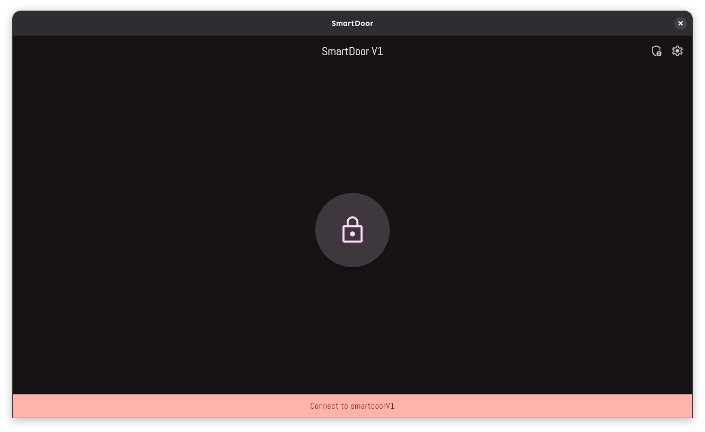
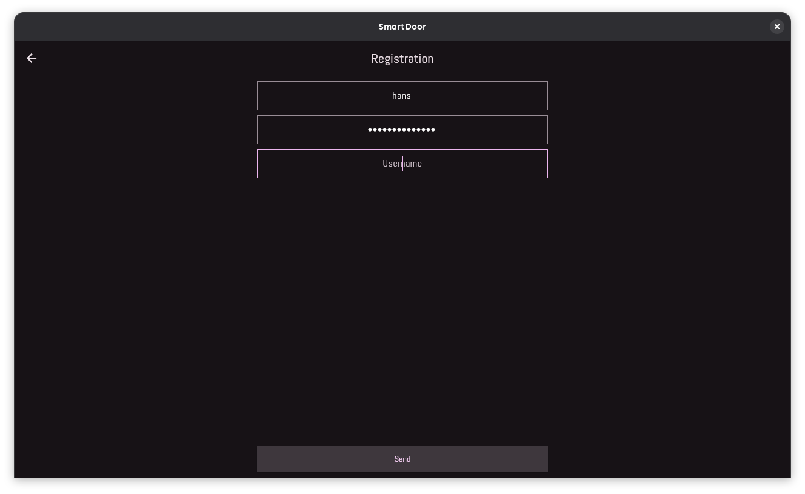
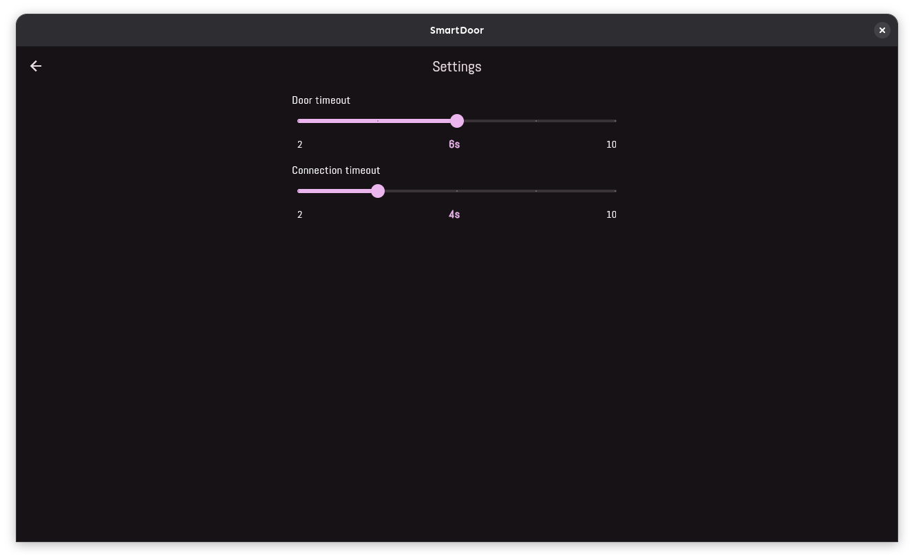

# SmartDoor

## SmartDoorV1

This application interacts with the smartdoorV1 door lock system.

## Features

- Registration
- Simple unlock interface
- Choose door unlock timeout

## Notes

- Use it in a secure Wi-Fi, the implementation uses http without any encryption in V1.

## Screenshots

- Home page
  

- Registration page
  

- Settings page
  
